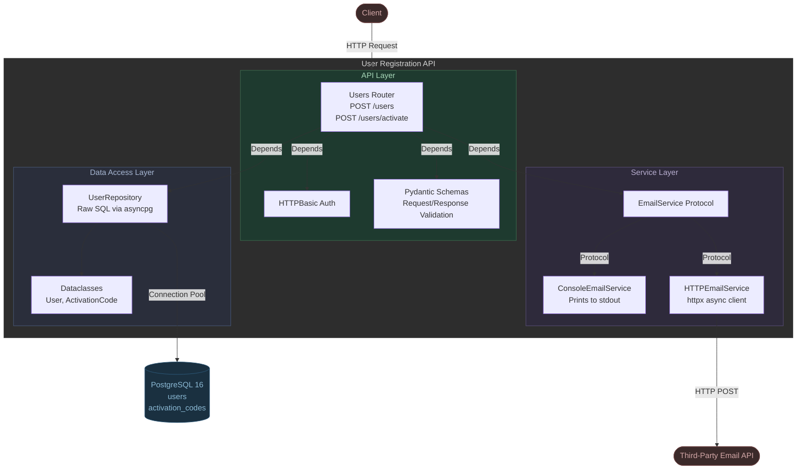

# User Registration API

API for handling user registration and account activation.

A user signs up with their email and password, gets a 4-digit activation code, and uses it to activate their account via Basic Auth. The code expires after 60 seconds.

## Getting Started

### Prerequisites

- Docker and Docker Compose

### Run the application

Copy `.env.example` to `.env` and run:

```bash
docker-compose up --build
```

The API is available at `http://localhost:8000`.
Swagger UI is available at `http://localhost:8000/docs`.

### Run the tests

```bash
docker-compose --profile test run --build test
```

### Reset the database

When testing manually with curl, the database persists between runs. To reset it:

```bash
docker-compose down -v
```

## API Reference

### POST /users — Register a new user

```bash
curl -X POST http://localhost:8000/users \
  -H "Content-Type: application/json" \
  -d '{"email": "user@example.com", "password": "secret123"}'
```

**Response 201:**
```json
{"id": "uuid", "email": "user@example.com"}
```

The activation code is printed in the application logs. Check it with:

```bash
docker-compose logs app
```

**Errors:**
| Status | Code | Description |
|--------|------|-------------|
| 409 | USER_ALREADY_EXISTS | Email already registered |
| 422 | — | Invalid email format |

### POST /users/activate — Activate account

Requires HTTP Basic Auth (email as username, password as password).

```bash
curl -X POST http://localhost:8000/users/activate \
  -u user@example.com:secret123 \
  -H "Content-Type: application/json" \
  -d '{"code": "1234"}'
```

**Response 200:**
```json
{"message": "Account activated successfully"}
```

**Errors:**
| Status | Code | Description |
|--------|------|-------------|
| 401 | INVALID_CREDENTIALS | Wrong email or password |
| 400 | INVALID_CODE | Wrong or already used code |
| 410 | CODE_EXPIRED | Code older than 60 seconds |

## Architecture



## Project Structure

```
app/
├── main.py              # FastAPI app, lifespan, exception handler
├── config.py            # Pydantic BaseSettings (env vars)
├── exceptions.py        # APIException base class + custom exceptions
├── db/
│   ├── pool.py          # asyncpg pool init/teardown
│   └── user_repository.py  # Raw SQL queries (no ORM)
├── routers/
│   └── users.py         # API endpoints + dependency injection
├── schemas/
│   └── user.py          # Pydantic request/response models
├── models/
│   └── user.py          # Dataclasses for DB records
└── services/
    └── email.py         # EmailService Protocol + implementations
```

## Stack

| Component | Technology |
|-----------|-----------|
| Framework | FastAPI |
| Database | PostgreSQL 16 |
| DB Driver | asyncpg (raw SQL, no ORM) |
| Validation | Pydantic v2 + pydantic-settings |
| Auth | FastAPI HTTPBasic |
| Hashing | pwdlib[bcrypt] |
| Email HTTP client | httpx |
| Testing | pytest + pytest-asyncio |
| Containers | Docker + Docker Compose |
